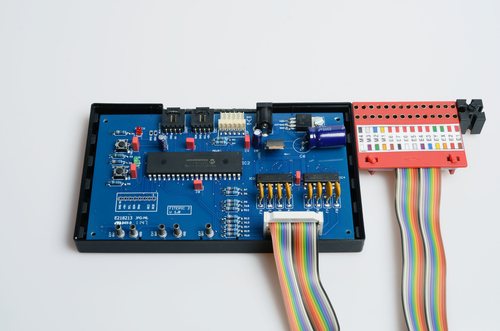

###Fitepic

Programmable controller for Fischertechnik models.

I had two Centronics-Port-Controllers from the 80s/90s lying around an could not get any of the old software to work. So I re-used the cases around a PIC-controlled board which allowed me to run autonomous programs made in C.

Has all necessary power regulators on board, can be used with Additionaly it has UART and I2C interfaces and ICSP.

PCB made with CadSoft Eagle.

###Images

Schematic [ page 1](Images/fite-controller-1-main.sch-1.png)

[ page 2](Images/fite-controller-1-main.sch-2.png)

###Tools

PIC 18F4550

MPLAB X 2

C18

###Remarks

Unfortunately theres an error on the board. The driver ICs must be installed reverse leading to a swap of channels. Otherwise they work fine.

###License

[BSD](LICENSE-BSD.txt) for software

[Creative Commons 4.0](LICENSE-CC.txt) for pcb and other artwork

###Copyright

Copyright (c) 2016 Bjoern Seip

